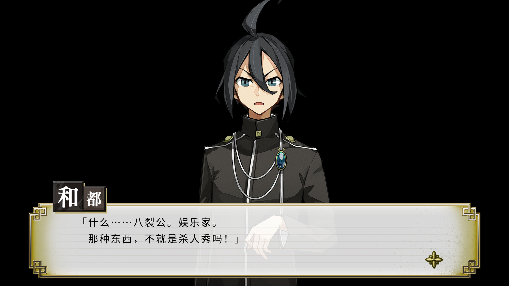

### Process of Elimination


POC（概念验证） chinese translation project for 侦探扑灭（Process of Elimination）

Only text extract and reimport for `Talk.dat` file.


```shell
# Put Data/Talk.dat
go run main.go

# texts.txt is generated
# translate the texts.txt to texts.ja.zh.txt 
# texts.ja.zh.txt is ja & zh line by line.

go run main.go
# use the talk.dat in root
```

>  You should read the code and change it yourself.

**`texts.ja.zh.txt` is translated by DeepSeek V3 without any proofreading**

### Screenshots




### Some notes

```c
struct TalkEntryData {
    u8* raw;
};

struct TalkEntry {
    u32  id;
    u32  dwUn0;
    u32  offset;
};

struct TalkDat {
    u32  dwEntrySize;
    u32  dwEntryCount;

    TalkEntry*      aEntries;
    TalkEntryData*  aEntryData;
};
```


1. `TalkEntry[i].size` can be calculated by $\textrm{offset}_i - \textrm{offset}_{i-1}$

   1. Be aware, `TalkEntry` may not stored in offset increase order, so sort before using it.

2. `TalkEntryData` is bytecode script,  text is defined as `0x10 u16(strlen) string 0x00`

   1. strlen = c-style string length (containing the ending \x00)

3. `TalkEntryData` may bigger than `TalkEntryData.size`, in `main.go` I just simple add 0x20 more bytes as padding (still use the size as range to fineText)

   